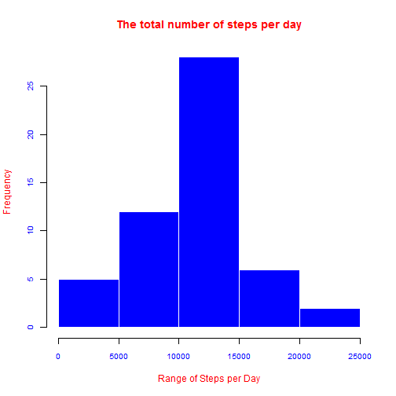
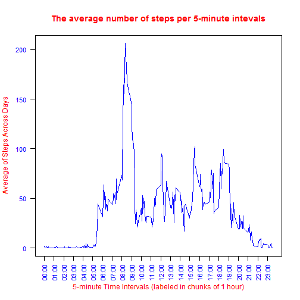
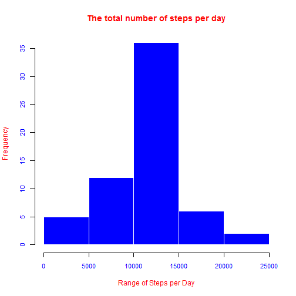
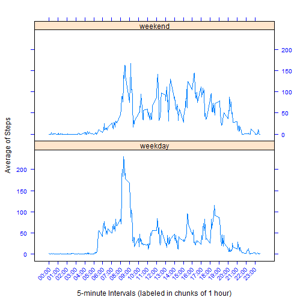

Peer Assignment 1 - Reproduciple Research Course
========================================================

In this assignment we will make use of data from a **personal activity** monitoring device. This device collects data at 5 minute intervals through out the day. The data consists of two months of data from an anonymous individual collected during the months of October and November, 2012 and include the *number of steps taken in 5 minute intervals each day*.

## The Dataset

The dataset is stored in a comma-separated-value (CSV) file and there are a total of 17,568 observations in this dataset. 

The dataset can be downloaded from [Activity monitoring data [52K]](https://d396qusza40orc.cloudfront.net/repdata%2Fdata%2Factivity.zip)

The variables included in this dataset are:
- **steps:** Number of steps taking in a 5-minute interval (missing values are coded as **NA**)
- **date:** The date on which the measurement was taken in **YYYY-MM-DD**
format
- **interval:** Identifier for the 5-minute interval in which measurement was taken

### Loading and preprocessing the data
1- We will load the dataset bu using the read.csv function.


```r
adata <- read.csv("activity.csv")
summary(adata)
```

```
##      steps               date          interval   
##  Min.   :  0.0   2012-10-01:  288   Min.   :   0  
##  1st Qu.:  0.0   2012-10-02:  288   1st Qu.: 589  
##  Median :  0.0   2012-10-03:  288   Median :1178  
##  Mean   : 37.4   2012-10-04:  288   Mean   :1178  
##  3rd Qu.: 12.0   2012-10-05:  288   3rd Qu.:1766  
##  Max.   :806.0   2012-10-06:  288   Max.   :2355  
##  NA's   :2304    (Other)   :15840
```


2- Convert the date factor to type Date

```r
adata$date <- as.Date(adata$date, format = "%Y-%m-%d")
summary(adata)
```

```
##      steps            date               interval   
##  Min.   :  0.0   Min.   :2012-10-01   Min.   :   0  
##  1st Qu.:  0.0   1st Qu.:2012-10-16   1st Qu.: 589  
##  Median :  0.0   Median :2012-10-31   Median :1178  
##  Mean   : 37.4   Mean   :2012-10-31   Mean   :1178  
##  3rd Qu.: 12.0   3rd Qu.:2012-11-15   3rd Qu.:1766  
##  Max.   :806.0   Max.   :2012-11-30   Max.   :2355  
##  NA's   :2304
```


### Mean and median total number of steps taken per day

1- We will first make a histogram of the total number of steps taken each day.

First we use the function **ddply** of the library **plyr** to compute the total number of steps taken per day:


```r
require(plyr)
stepsPerDay <- ddply(adata, .(date), summarize, totalSteps = sum(steps))
```


then we make a histogram by subdivising the total number of steps in ranges (X-axis) and gives the frequencies (Y-axis) of days in every range.


```r
par(col.main = "red", col.lab = "red", col.axis = "blue", cex.axis = 0.8)

hist(stepsPerDay$totalSteps, col = "blue", border = "white", xlab = "Range of Steps per Day", 
    main = "The total number of steps per day")
```

 


2- We can now compute the **mean** and **median** of total number of steps per day as follow:

```r
meanStepsPerDay <- mean(stepsPerDay$totalSteps, na.rm = TRUE)
meanStepsPerDay
```

```
## [1] 10766
```

```r
medianStepsPerDay <- median(stepsPerDay$totalSteps, na.rm = TRUE)
medianStepsPerDay
```

```
## [1] 10765
```

So, the mean of total number of steps per day is **10766.19** and the median of total number of steps per day is **10765**.

### The average daily activity pattern

1- First, we will compute the average number of steps across all days for the 5-minute intervals 


```r
meanStepsPerInterval <- ddply(adata, .(interval), summarize, mean = mean(steps, 
    na.rm = TRUE))
summary(meanStepsPerInterval)
```

```
##     interval         mean       
##  Min.   :   0   Min.   :  0.00  
##  1st Qu.: 589   1st Qu.:  2.49  
##  Median :1178   Median : 34.11  
##  Mean   :1178   Mean   : 37.38  
##  3rd Qu.:1766   3rd Qu.: 52.83  
##  Max.   :2355   Max.   :206.17
```


We will make a graphical presentation of the average number of steps taken (y-axis) for each the 5-minute interval (x-axis), averaged across all days 


```r
# set the color to titles
par(col.main = "red", col.lab = "red", col.axis = "blue", cex.axis = 0.9)

plot(meanStepsPerInterval$interval, meanStepsPerInterval$mean, type = "l", xaxt = "n", 
    yaxt = "n", col = "blue", main = "The average number of steps per 5-minute intevals", 
    xlab = "5-minute Time Intervals (labeled in chunks of 1 hour)", ylab = "Average of Steps Across Days")

indices <- seq(1, nrow(meanStepsPerInterval), by = 12)
xlabels <- sprintf("%02d:%02d", meanStepsPerInterval$interval%/%100, meanStepsPerInterval$interval%%100)
axis(1, meanStepsPerInterval$interval[indices], xlabels[indices], las = 3)
axis(2, las = 1)
```

 


2- We can compute the 5-minute interval that contains the maximum number of steps on average across all days 


```r
indeMaxInterval <- which.max(meanStepsPerInterval$mean)
maxInterval <- meanStepsPerInterval$interval[indeMaxInterval]
maxInterval
```

```
## [1] 835
```

```r
intervalTime <- sprintf("%02d:%02d", maxInterval%/%100, maxInterval%%100)
intervalTime
```

```
## [1] "08:35"
```

So, **835** is the 5-minute interval in question (correspond to the time 08:35).

### Imputing missing values

1- We can compute the number of missing data by using the functions **is.na** and **table**. As it is required in the assignment, we have to look after NB values by rows whatever the missing values in the dataset, I will not restrein the test to the steps only. So we can use the following script

```r
nbNA <- table((is.na(adata$steps) | is.na(adata$date) | is.na(adata$interval)))[["TRUE"]]
nbNA
```

```
## [1] 2304
```

So, the number of **NA** in the dataset is **2304**.

2- For the missing values I will use the average of the corresponding 5-minute interval to replace it.

3- Create the new dataset by replacing missing values by corresponding 5-minute interval averages across all days. So, after getting the averages of 5-minute intervals, we duplicate them as many as there are days to fill in the missing values of steps by the corresponding average ones. 

```r
newData <- adata
# duplicate the the average of interval to match the length of all days
dupmean <- rep(meanStepsPerInterval$mean, length(table(adata$date)))
isNA <- is.na(adata$steps)
newData$steps[isNA] <- dupmean[isNA]
```


4- Compute the total number of steps per day:


```r
stepsPerDay <- ddply(newData, .(date), summarize, totalSteps = sum(steps))
```


then we make a histogram by subdivising the total number of steps in ranges (X-axis) and gives the frequencies (Y-axis) of days in every range.


```r
par(col.main = "red", col.lab = "red", col.axis = "blue", cex.axis = 0.9)
hist(stepsPerDay$totalSteps, col = "blue", border = "white", xlab = "Range of Steps per Day", 
    main = "The total number of steps per day")
```

 


The **mean** and **median** of total number of steps per day are computed as follow:

```r
meanStepsPerDay <- mean(stepsPerDay$totalSteps)
meanStepsPerDay
```

```
## [1] 10766
```

```r
medianStepsPerDay <- median(stepsPerDay$totalSteps)
medianStepsPerDay
```

```
## [1] 10766
```

So, the mean of total number of steps per day is **10766.19** and the median of total number of steps per day is **10766.19**.

In general, there are not difference in histogram form with almost the same values for the mean and ,edian, but the number of steps is becoming bigger especially around the median.


Now, I will introduce a new data field in the new dataset. first I initialize this filed to be completely to the `weeday` value then I modify the values corresponding to `Saturday` and `Sunday` to the value `weekend`.

```r
newData$week <- "weekday"
isWeekend <- weekdays(as.Date(newData$date)) == "Sunday" | weekdays(as.Date(newData$date)) == 
    "Saturday"
newData$week[isWeekend] <- "weekend"
```


After adding the fied week to the new dataset, we can compute the 5-minute interval average across weekday and weekend as follow:


```r
meanAcrossWeekdays <- ddply(newData, .(week, interval), summarize, mean = mean(steps))
summary(meanStepsPerInterval)
```

```
##     interval         mean       
##  Min.   :   0   Min.   :  0.00  
##  1st Qu.: 589   1st Qu.:  2.49  
##  Median :1178   Median : 34.11  
##  Mean   :1178   Mean   : 37.38  
##  3rd Qu.:1766   3rd Qu.: 52.83  
##  Max.   :2355   Max.   :206.17
```


Finally, we can plot the 5-minute interval steps averaged across weekdays and weekend by using xyplot function of the package `lattice`


```r
require(lattice)
meanAcrossWeekdays$week <- as.factor(meanAcrossWeekdays$week)
indices <- seq(1, nrow(meanStepsPerInterval), by = 12)

# xlabels contains the times corresponding to 5-minute intervals indices
# contains the indices of values to use for x-axis anntations

xyplot(mean ~ interval | week, meanAcrossWeekdays, type = c("l", "l"), layout = c(1, 
    2), ylab = "Average of Steps", xlab = "5-minute Intervals (labeled in chunks of 1 hour)", 
    scales = list(col = "blue", x = list(labels = xlabels[indices], rot = c(45), 
        at = meanStepsPerInterval$interval[indices])))
```

 


We have noticed that:

-In **weekend**, people are far active during all the day comparing to the night where they become gradually inactive in the evening, we also noticed more activity early morning around 8 AM.

-In **weekdays**, people are completeley inactive in the night and they become active more early comparing to the weekend starting from 5:30 AM, At 8 AM starts the top activity period till 9 AM where the activity drops dramatically to become marginal all the day except in the period of lunch (12 - 13 PM), the activity returns at the end of the day especially a the period of return fron work (18-19PM) then it returns gradually to almost inactive around 10 PM.

**Thank you**
